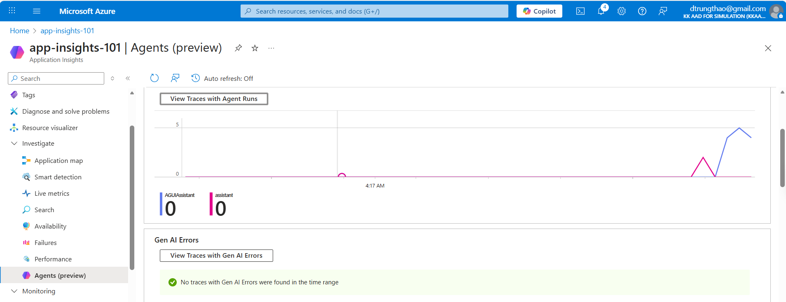
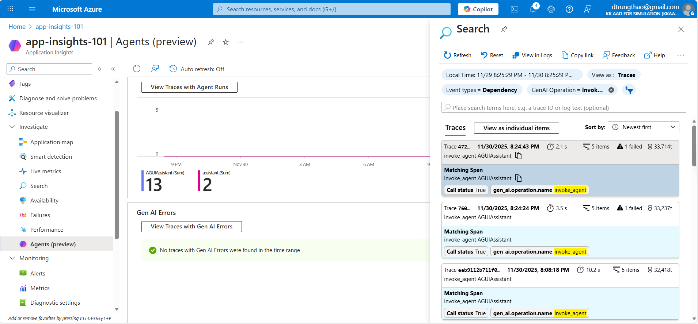
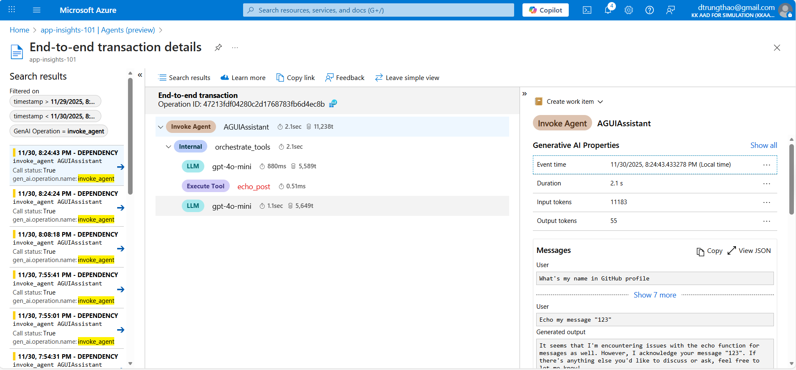

# Application Insights Queries for AGUIAssistant Agent

This document contains Kusto Query Language (KQL) queries for analyzing AGUIAssistant telemetry in Azure Application Insights.

## Setup

The agent uses OpenTelemetry with Azure Monitor exporter. The telemetry data includes GenAI semantic conventions in `customDimensions`.

**Key Custom Dimensions:**
- `gen_ai.operation.name`: Operation type (e.g., "chat")
- `gen_ai.request.model`: Model name (e.g., "gpt-5-chat")
- `gen_ai.agent.name`: Agent name (e.g., "AGUIAssistant")
- `ag_ui_thread_id`: AG-UI conversation thread ID
- `ag_ui_run_id`: AG-UI run ID

```kusto
union traces, dependencies, requests
| where customDimensions.['ag_ui_thread_id'] == '10b45773-7a3d-4d63-899c-d861cd46e0d7'
| project 
    timestamp,
    itemType,
    target,
    message,
    duration,
    genAiOperation = customDimensions.['gen_ai.operation.name'],
    InputData = customDimensions.["gen_ai.input.messages"], 
    OutputData = customDimensions.["gen_ai.output.messages"]
| order by timestamp desc
```
## Agent preview
- Click `Investigate` menu, go to `Agents (preview)`
- Click `View Traces with Agent Runs`

- Click one trace

- See the trace tree



## Basic Queries

### 1. All Agent Chat Operations
```kusto
dependencies
| where customDimensions.['gen_ai.operation.name'] == "chat"
| order by timestamp desc
```

### 2. All Agent Operations by Model
```kusto
dependencies
| where customDimensions.['gen_ai.request.model'] == "gpt-5-chat"
| order by timestamp desc
```

### 3. All AG-UI Requests
```kusto
dependencies
| where isnotempty(customDimensions.['ag_ui_thread_id'])
| order by timestamp desc
```

## Agent Invocation Queries

### 4. Agent Invocations with Token Usage
```kusto
dependencies
| where customDimensions.['gen_ai.operation.name'] == "chat"
| project 
    timestamp,
    name,
    duration,
    model = customDimensions.['gen_ai.request.model'],
    inputTokens = toint(customDimensions.['gen_ai.usage.input_tokens']),
    outputTokens = toint(customDimensions.['gen_ai.usage.output_tokens']),
    totalTokens = toint(customDimensions.['gen_ai.usage.input_tokens']) + toint(customDimensions.['gen_ai.usage.output_tokens']),
    finishReason = customDimensions.['gen_ai.response.finish_reasons'],
    threadId = customDimensions.['ag_ui_thread_id'],
    runId = customDimensions.['ag_ui_run_id']
| order by timestamp desc
```

### 5. Agent Performance Metrics
```kusto
dependencies
| where customDimensions.['gen_ai.operation.name'] == "chat"
| summarize 
    Count = count(),
    AvgDuration = avg(duration),
    P50Duration = percentile(duration, 50),
    P95Duration = percentile(duration, 95),
    P99Duration = percentile(duration, 99),
    TotalInputTokens = sum(toint(customDimensions.['gen_ai.usage.input_tokens'])),
    TotalOutputTokens = sum(toint(customDimensions.['gen_ai.usage.output_tokens']))
    by bin(timestamp, 1h)
| order by timestamp desc
```

## Tool/Function Call Queries

### 6. All Tool Definitions Used
```kusto
dependencies
| where isnotempty(customDimensions.['gen_ai.tool.definitions'])
| project 
    timestamp,
    tools = parse_json(customDimensions.['gen_ai.tool.definitions'])
| mv-expand tool = tools
| project 
    timestamp,
    toolName = tool.name,
    toolDescription = tool.description
| summarize count() by toolName, toolDescription
| order by count_ desc
```

### 7. Tool Invocations from Messages
```kusto
dependencies
| where customDimensions.['gen_ai.operation.name'] == "chat"
| where customDimensions.['gen_ai.input.messages'] contains "tool_call"
| extend messages = parse_json(customDimensions.['gen_ai.input.messages'])
| mv-expand message = messages
| where message.role == "assistant" and isnotempty(message.parts)
| mv-expand part = message.parts
| where part.type == "tool_call"
| project 
    timestamp,
    toolName = part.name,
    toolId = part.id,
    threadId = customDimensions.['ag_ui_thread_id']
| order by timestamp desc
```

### 8. Tool Invocation Success/Failure
```kusto
dependencies
| where customDimensions.['gen_ai.input.messages'] contains "tool"
| extend messages = parse_json(customDimensions.['gen_ai.input.messages'])
| mv-expand message = messages
| where message.role == "tool"
| mv-expand part = message.parts
| extend 
    toolId = part.id,
    response = tostring(part.response),
    isError = response contains "Error"
| summarize 
    Total = count(),
    Errors = countif(isError),
    Success = countif(not(isError))
    by bin(timestamp, 1h)
| extend ErrorRate = (Errors * 100.0) / Total
| order by timestamp desc
```

## Authentication & Security Queries

### 9. JWT Authentication Events
```kusto
traces
| where message contains "JwtBearer"
| extend 
    event = case(
        message contains "Token validated", "TokenValidated",
        message contains "Authentication failed", "AuthFailed",
        message contains "Message received", "MessageReceived",
        "Other"
    ),
    hasAuthHeader = message contains "True"
| project timestamp, event, hasAuthHeader, message
| order by timestamp desc
```

### 10. Failed Authentication Attempts
```kusto
traces
| where message contains "JwtBearer: Authentication failed"
| project timestamp, message, severityLevel
| order by timestamp desc
```

## Error & Exception Queries

### 11. All Exceptions Related to Agent
```kusto
exceptions
| where operation_Name contains "agent" or customDimensions.['otel.scope.name'] == "AGUIAssistant.Telemetry"
| project timestamp, type, outerMessage, innermostMessage, operation_Name
| order by timestamp desc
```

### 12. Failed Tool Invocations
```kusto
traces
| where customDimensions.['otel.scope.name'] == "AGUIAssistant.Telemetry"
| where severityLevel >= 3 // Warning or higher
| where message contains "Middleware" or message contains "tool"
| project timestamp, severityLevel, message, operation_Id
| order by timestamp desc
```

## Cost & Usage Queries

### 13. Token Usage by Time Period
```kusto
dependencies
| where customDimensions.['gen_ai.operation.name'] == "chat"
| summarize 
    TotalCalls = count(),
    TotalInputTokens = sum(toint(customDimensions.['gen_ai.usage.input_tokens'])),
    TotalOutputTokens = sum(toint(customDimensions.['gen_ai.usage.output_tokens']))
    by bin(timestamp, 1d)
| extend TotalTokens = TotalInputTokens + TotalOutputTokens
| project timestamp, TotalCalls, TotalInputTokens, TotalOutputTokens, TotalTokens
| order by timestamp desc
```

### 14. Most Expensive Requests (by tokens)
```kusto
dependencies
| where customDimensions.['gen_ai.operation.name'] == "chat"
| extend 
    totalTokens = toint(customDimensions.['gen_ai.usage.input_tokens']) + toint(customDimensions.['gen_ai.usage.output_tokens'])
| project 
    timestamp,
    operation_Id,
    model = customDimensions.['gen_ai.request.model'],
    inputTokens = toint(customDimensions.['gen_ai.usage.input_tokens']),
    outputTokens = toint(customDimensions.['gen_ai.usage.output_tokens']),
    totalTokens,
    threadId = customDimensions.['ag_ui_thread_id']
| top 100 by totalTokens desc
```

## Sensitive Data Queries (when EnableSensitiveData = true)

### 15. Agent Prompts and Completions
```kusto
dependencies
| where customDimensions.['gen_ai.operation.name'] == "chat"
| project 
    timestamp,
    operation_Id,
    systemInstructions = parse_json(customDimensions.['gen_ai.system_instructions']),
    inputMessages = parse_json(customDimensions.['gen_ai.input.messages']),
    outputMessages = parse_json(customDimensions.['gen_ai.output.messages']),
    model = customDimensions.['gen_ai.request.model'],
    threadId = customDimensions.['ag_ui_thread_id']
| order by timestamp desc
```

⚠️ **Warning**: Only use this query in non-production environments. Sensitive data logging should be disabled in production.

### 15a. Extract User Messages Only
```kusto
dependencies
| where customDimensions.['gen_ai.operation.name'] == "chat"
| extend inputMessages = parse_json(customDimensions.['gen_ai.input.messages'])
| mv-expand message = inputMessages
| where message.role == "user"
| mv-expand part = message.parts
| where part.type == "text"
| project 
    timestamp,
    userMessage = part.content,
    threadId = customDimensions.['ag_ui_thread_id']
| order by timestamp desc
```

### 15b. Extract Assistant Responses Only
```kusto
dependencies
| where customDimensions.['gen_ai.operation.name'] == "chat"
| extend outputMessages = parse_json(customDimensions.['gen_ai.output.messages'])
| mv-expand message = outputMessages
| where message.role == "assistant"
| mv-expand part = message.parts
| where part.type == "text"
| project 
    timestamp,
    assistantResponse = part.content,
    threadId = customDimensions.['ag_ui_thread_id']
| order by timestamp desc
```

## Combined Analysis Queries

### 16. End-to-End Request Flow
```kusto
union traces, dependencies, requests
| where operation_Id == "YOUR_OPERATION_ID_HERE"
| project 
    timestamp,
    itemType,
    name,
    message,
    duration,
    genAiOperation = customDimensions.['gen_ai.operation.name'],
    threadId = customDimensions.['ag_ui_thread_id']
| order by timestamp asc
```

### 17. Agent Success Rate
```kusto
dependencies
| where customDimensions.['gen_ai.operation.name'] == "chat"
| summarize 
    Total = count(),
    Successful = countif(success == true),
    Failed = countif(success == false)
    by bin(timestamp, 1h)
| extend SuccessRate = (Successful * 100.0) / Total
| project timestamp, Total, Successful, Failed, SuccessRate
| order by timestamp desc
```

### 18. Conversation Analysis by Thread
```kusto
dependencies
| where isnotempty(customDimensions.['ag_ui_thread_id'])
| extend threadId = tostring(customDimensions.['ag_ui_thread_id'])
| summarize 
    MessageCount = count(),
    TotalTokens = sum(toint(customDimensions.['gen_ai.usage.input_tokens']) + toint(customDimensions.['gen_ai.usage.output_tokens'])),
    AvgDuration = avg(duration),
    FirstMessage = min(timestamp),
    LastMessage = max(timestamp)
    by threadId
| extend ConversationDuration = LastMessage - FirstMessage
| order by LastMessage desc
```

## Custom Dimensions Reference

When querying Application Insights, the following custom dimensions are available:

### GenAI Semantic Conventions
- `gen_ai.operation.name`: Operation type (e.g., "chat")
- `gen_ai.request.model`: Model name (e.g., "gpt-5-chat")
- `gen_ai.provider.name`: Provider (e.g., "openai")
- `gen_ai.usage.input_tokens`: Input token count
- `gen_ai.usage.output_tokens`: Output token count
- `gen_ai.response.finish_reasons`: Completion finish reason (e.g., ["stop"])
- `gen_ai.response.id`: Response ID from the LLM
- `gen_ai.response.model`: Actual model used in response
- `gen_ai.tool.definitions`: JSON array of available tools/functions

### AG-UI Specific
- `ag_ui_thread_id`: Unique conversation thread identifier
- `ag_ui_run_id`: Unique run identifier for this agent invocation
- `ag_ui_state`: State object (usually empty `{}`)
- `ag_ui_context`: Additional context
- `ag_ui_forwarded_properties`: Forwarded properties

### Sensitive Data (when EnableSensitiveData = true)
- `gen_ai.system_instructions`: System prompt/instructions as JSON array
- `gen_ai.input.messages`: Full conversation history as JSON array
- `gen_ai.output.messages`: Agent's response messages as JSON array

### Message Structure (in gen_ai.input.messages and gen_ai.output.messages)
Each message contains:
- `role`: "user", "assistant", "tool", or "system"
- `parts`: Array of message parts
  - `type`: "text", "tool_call", or "tool_call_response"
  - `content`: The actual text content
  - `id`: Tool call ID (for tool_call types)
  - `name`: Tool/function name (for tool_call types)
  - `arguments`: Tool arguments (for tool_call types)
  - `response`: Tool response (for tool_call_response types)

## Dashboard Recommendations

Create Application Insights workbooks with:

1. **Agent Performance Dashboard**: Query #5, #17
2. **Cost Analysis Dashboard**: Query #13, #14
3. **Security Monitoring Dashboard**: Query #9, #10
4. **Tool Usage Dashboard**: Query #7, #18
5. **Error Tracking Dashboard**: Query #11, #12

## Notes

- Replace `"YOUR_OPERATION_ID_HERE"` with actual operation IDs from your logs
- Adjust time ranges using `| where timestamp > ago(24h)` or similar filters
- For production environments, disable `EnableSensitiveData` to avoid logging prompts/completions
- Token counts can be used to estimate costs based on your Azure OpenAI pricing tier
